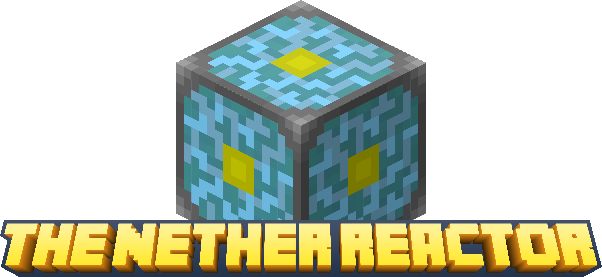

This is a recreation of the Nether Reactor from early Minecraft: Pocket Edition, now as a Minecraft: Java Edition datapack! It aims to be as accurate as possible to the original experience, except for a few minor quality-of-life changes.

This a vanilla Minecraft 1.21.5 datapack, no mods required. Though there is a small resource pack with the textures for the two new blocks.

Download both the datapack and resource pack from the [Releases page](https://github.com/DieGo367/NetherReactor/releases)!

## Features
- Adds two new blocks, the **Nether Reactor Core** and **Glowing Obsidian**.
- Adds a crafting recipe for the core.
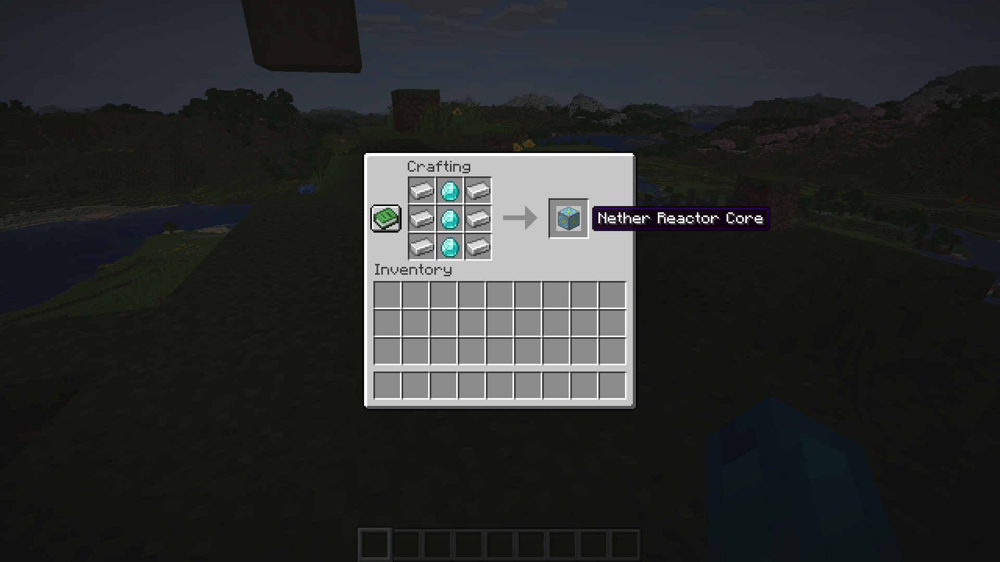
- Adds the Nether Reactor, a player-built structure that spawns a large netherrack spire, hostile pigmen, and some loot.
  - The Nether Reactor is built using the following structure, layer by layer:
  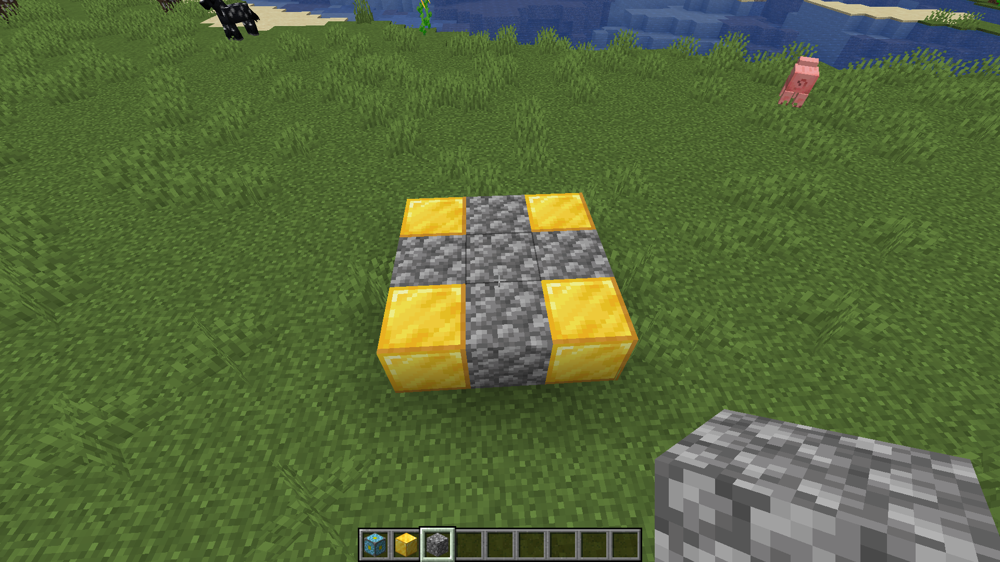
  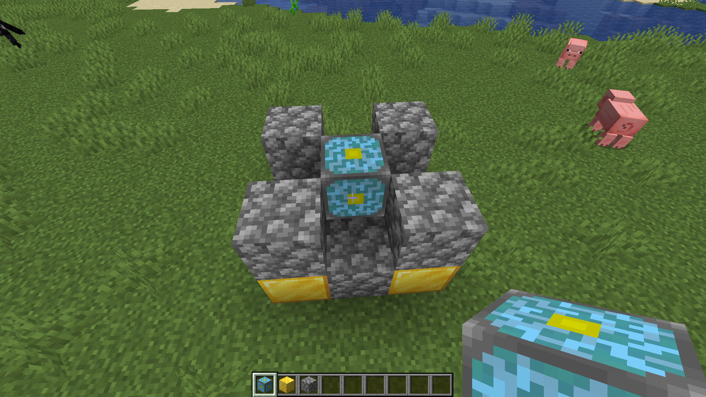
  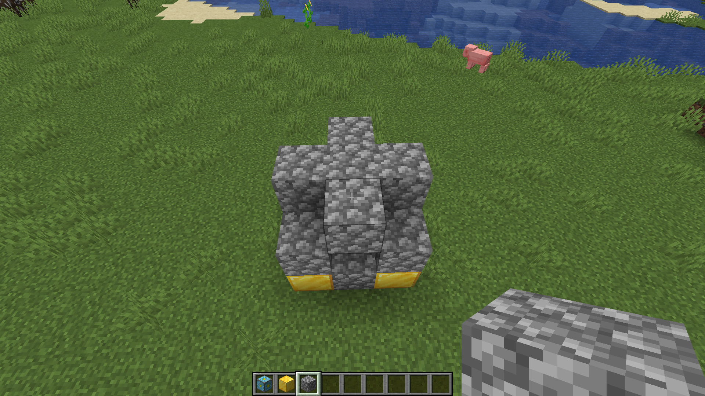
  - The reaction begins when a player interacts (right-clicks) with the core, summoning the **Nether Spire**.
  - While the reaction is going:
    - The blocks of the structure are replaced by Glowing Obsidian. These are obtainable via Diamond Pickaxe.
	- Zombified Piglins will spawn occasionally, typically towards the beginning of the reaction. These are automatically hostile to players.
	- Loot items will spawn. The following screenshot shows all the possible drops in the chest. These are equally weighted between the items, and the stack count for each is fixed. The hotbar in the screenshot has an example yield from a single run of the reactor.
	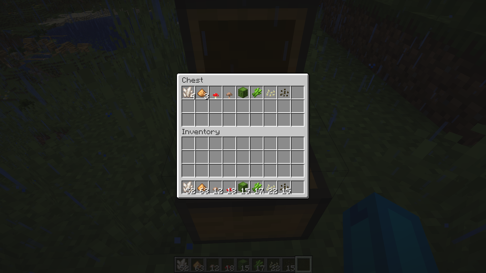
	- The world will progress to midnight and stay there until the reaction is complete.
	  - The old "infinite night glitch" is intentionally recreated here. If the reaction is interrupted by breaking the core, the reaction will end but the night will remain until another reaction is completed.
  - When the reaction is complete, the center structure is replaced by obsidian, and the outer walls of the spire decay in a random pattern. The dead core is still retrievable inside the obsidian casing.

## Changes/additions compared to MCPE
- There's a bossbar on screen to show the reaction progress.
- The Nether Reactor structure can be built with either Blackstone or Cobbled Deepslate instead of Cobblestone.
- Not a change per se, but the Nether Reactor will work in any dimension.
- Expanded the vertical range in which the core can be placed, depending on the build height of the current dimension. The limit is between 8 blocks above the lower build limit and 30 blocks below the upper build limit.
- Removed the requirement for all players in the world to be near the Nether Reactor to activate it.

## Screenshots
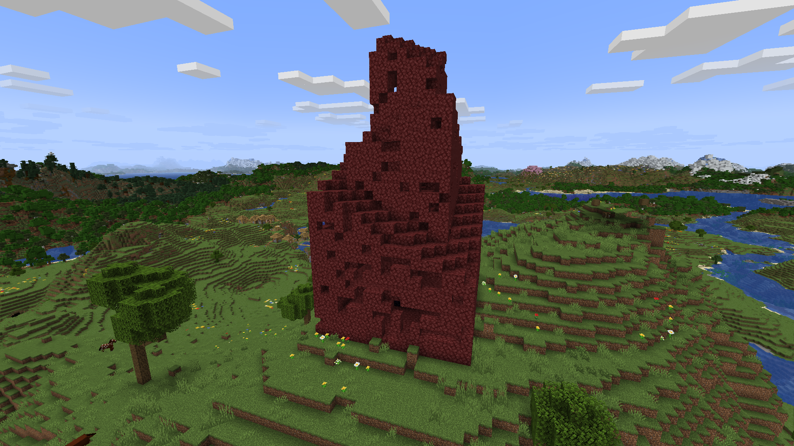
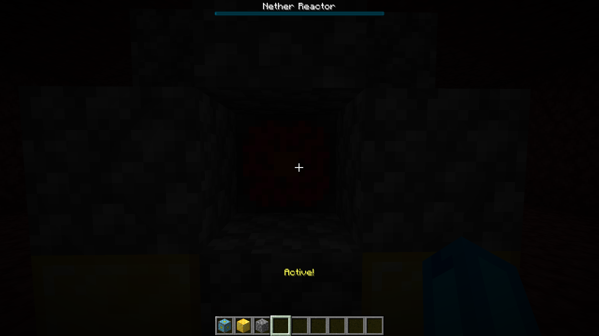
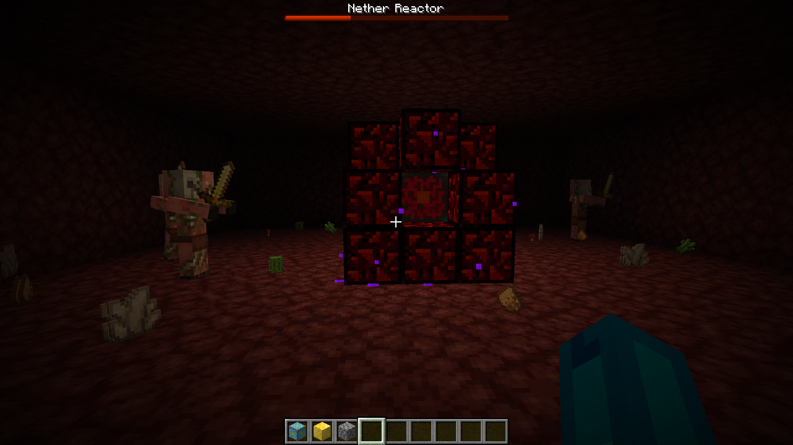
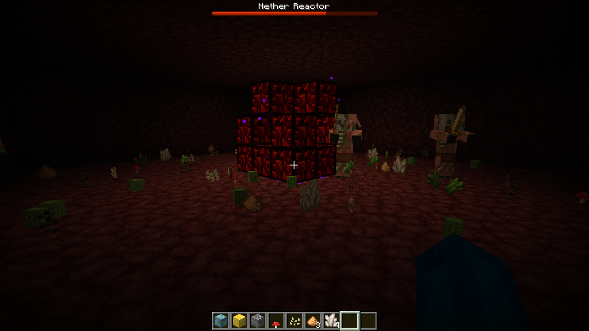
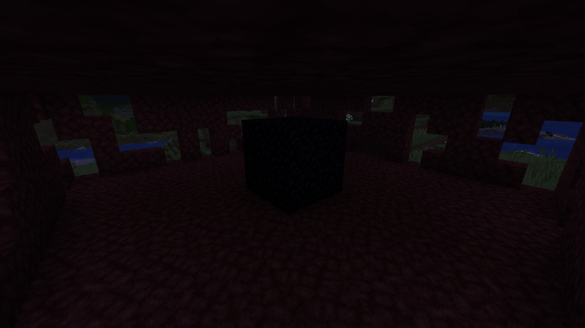
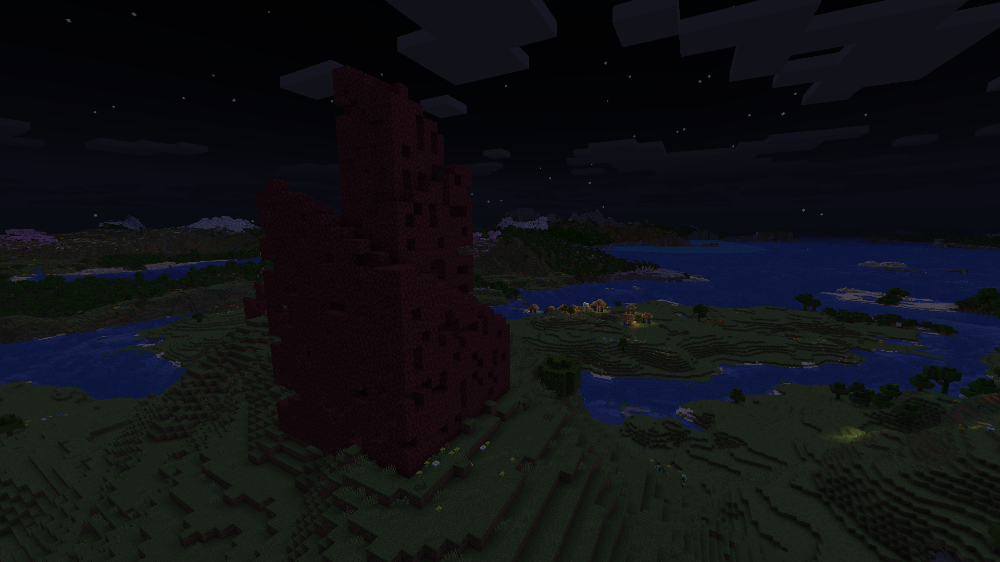

## Technical (Build information)
The source code to this datapack is written in MCQuick, my personal Minecraft datapack language. It is currently unreleased, but it will be happening soon™.

